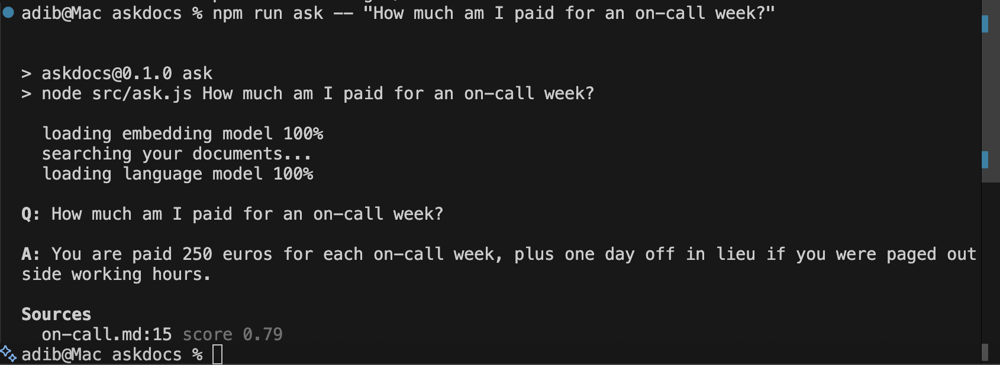

# askdocs

Ask questions about your own notes from the terminal, and get a short answer plus the file and line it came from. Everything runs on your machine with Tether's [QVAC SDK](https://qvac.tether.io).



Your notes are never uploaded anywhere. There is no API key and no per-question bill, and after the first run it works offline.

## Requirements

- **Node.js** >= 22.17
- **A platform QVAC supports.** Built on macOS on Apple silicon. See the [QVAC system requirements](https://docs.qvac.tether.io/system-requirements/) for Linux and Windows.
- **About 6 GB of free disk**: ~4.8 GB for `node_modules` (the SDK ships native engines for every modality) and ~1.4 GB for the two models, cached once under `~/.qvac`.

## Install

```bash
git clone https://github.com/hasinabraradib-tech/askdocs.git
cd askdocs
npm install
```

## Run

**1. Index a folder** of `.md`, `.markdown` or `.txt` files (subfolders included):

```bash
npm run index -- samples
```

**2. Ask it things:**

```bash
npm run ask -- "How much am I paid for an on-call week?"
npm run ask -- "Can I carry leftover vacation days over?"
```

If your notes don't contain the answer, it says so instead of guessing:

```
$ npm run ask -- "What is the office wifi password?"
A: I could not find that in your documents.
```

**3. Keep separate folders apart** with `--index`. Each name is its own store, so a question about your course notes never pulls in your work handbook:

```bash
npm run index -- ~/notes/uni --index uni
npm run ask -- "When are lab reports due?" --index uni
npm run indexes          # list every index, its folder and when it was built
```

Without `--index`, both commands use an index called `default`. Running `index` again with the same name replaces that index and leaves the others alone. The first run downloads the model weights; every run after that is offline.

`samples/` holds three short pages of a made-up team handbook to try it on.

## QVAC SDK version

**`@qvac/sdk` 0.19.1**, declared in `package.json`:

```json
"dependencies": {
  "@qvac/sdk": "^0.19.1"
}
```

## QVAC functions used

| Function | Used in | What it does here |
|---|---|---|
| `loadModel` | `src/models.js` | Loads the embedding model and the language model. |
| `ragIngest` | `src/index.js` | Embeds every passage and stores it in a local vector store. |
| `ragSearch` | `src/ask.js` | Finds the passages closest in meaning to the question. |
| `completion` | `src/ask.js` | Writes the answer from those passages. |
| `ragDeleteWorkspace`, `ragCloseWorkspace` | `src/index.js`, `src/ask.js` | Clears the old index before re-indexing; releases the store when done. |
| `unloadModel`, `close` | `src/index.js`, `src/ask.js` | Frees the models and stops the SDK worker so the process exits. |

## Models

| Model | Constant | Role |
|---|---|---|
| GTE large, FP16 | `GTE_LARGE_FP16` | Turns passages and questions into vectors for search. |
| Llama 3.2 1B Instruct, Q4_0 | `LLAMA_3_2_1B_INST_Q4_0` | Reads the matching passages and writes the answer. |

## How it works

1. **Split.** `src/passages.js` cuts each file into passages along paragraph lines, and every heading starts a new passage. Short paragraphs in one section are joined, so a heading is never stored on its own.
2. **Index.** `ragIngest` embeds the passages with `chunk: false`, because they are already split. Each named index is its own workspace in the vector store. The store keeps only text, so `src/store.js` also writes `.askdocs/<name>.json`, which maps each passage back to its file and line.
3. **Search.** `ragSearch` returns the three closest passages. Only those within 0.05 of the best score are kept.
4. **Answer.** `completion` at `temp: 0` answers from the kept passages, and the sources printed underneath are exactly the passages it was shown.

## Design notes

These were measured on the sample notes, not guessed.

**Weak matches are dropped before the model sees them.** Given three passages, a 1B model uses all three, so an unrelated on-call rule would turn up in an answer about expenses. On the samples, passages that answer the question score within a few hundredths of the best match, and unrelated ones fall 0.08 or more behind. The cut sits at 0.05.

**Citations come from code, not from the model.** Asking the model to cite `[1]`, `[2]` made it answer in numbered lists, with one item per source whether or not the source was relevant. Now it only answers, and askdocs lists the passages it was given.

**Heading marks are removed from what the model reads.** Otherwise it copies `## Compensation` into the answer.

**`temp: 0`**, so the same question over the same notes always gets the same answer.

## Limitations

- **Wording matters more than it should.** "What happens if I miss a page at night?" gets "could not find", but "What happens if I don't acknowledge a page in time?" is answered correctly from the same passage. The small model plays it safe when the question and the text don't share words.
- **Text files only.** PDFs and Word documents are not read yet.
- The SDK marks its built-in vector store as a prototype. It is fine for a folder of notes but not for millions of documents.

## Project structure

```
askdocs/
├── src/
│   ├── models.js    Model choices and a loader with progress
│   ├── passages.js  Reading a folder and splitting it into passages
│   ├── store.js     Mapping passages back to file and line, per index
│   ├── args.js      The --index option
│   ├── index.js     npm run index
│   ├── ask.js       npm run ask
│   └── indexes.js   npm run indexes
├── samples/         A small made-up handbook to try it on
└── assets/          Screenshot for this README
```

## License

[MIT](LICENSE)
